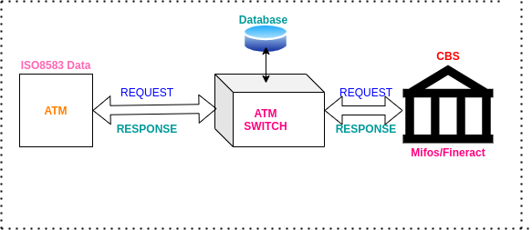
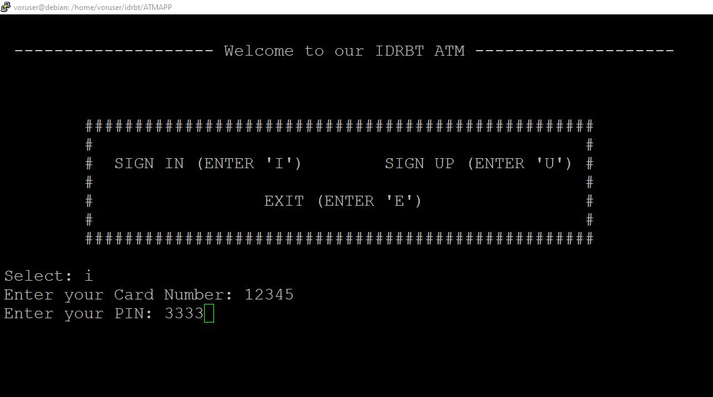
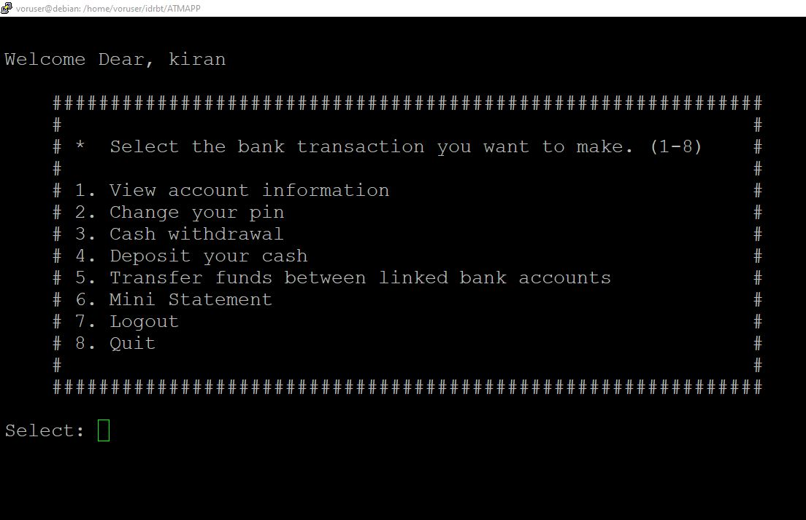

# atm
# ATM App

ATM terminal application and switch solution project repository

* config.ini – MYSQL host and databases (ATM, CBS) configuration details file.
* db_lib.py – DB connection (connected/not connected) object creation file.
* python_mysql_dbconfig.py – Read database configuration file and return a dictionary object.
* atm.py – Complete master source code file for the entire application written in python language.
* requirements.txt – requirements file for the list of python packages used in this project.
* readme.md – Information about the project structure, directory and files.
* atm.sql – SQL file for importing data to MYSQL database.

# Installation procedure

## Step-1: Software Requirements
Install Python: 
    **Linux:** sudo apt install python3.8 / 
    **Windows:** Download executable from official python site(https://www.python.org/downloads/) and install.
    
Install XAMPP server(https://www.apachefriends.org/download.html) in Linux/Windows environment.After installation, We can check the version of the Apache web server and MySQL server.

**Web Server:**
* Apache - 2.4.46
* PHP - 7.4.10
* Database client version: libmysql - mysqlnd 7.4.10

**Database Server:**
* Server: localhost
* Server type: MariaDB
* Server version: 10.4.14-MariaDB - Source distribution

Start the services using XAMPP control panel.

**note***: You can skip the installation of above mentioned software in case your local system/development environment is already having them.(only the IP address need to be changed in config.ini and wherever it is neccessary)

## Step-2: Database and Table Creation
Create a database with name "atm" using phpmyadmin interface. Open this link in the browser http://localhost/phpmyadmin/index.php

CREATE DATABASE atm;

Create 2 tables with table name as "customers" and "atm_txns" under database "atm" using phpmyadmin.

**SQL query for creation of tables :** 

* CREATE TABLE `customers` (
  `cardNumber` int(11) NOT NULL,
  `name` text DEFAULT NULL,
  `surname` text DEFAULT NULL,
  `pin` int(11) DEFAULT NULL,
  `mail` text DEFAULT NULL,
  `money` varchar(12) DEFAULT NULL
) ENGINE=InnoDB DEFAULT CHARSET=utf8mb4;

* CREATE TABLE `atm_txns` (
  `rr_num` int(11) NOT NULL,
  `cardNumber` varchar(20) DEFAULT NULL,
  `amount` varchar(15) DEFAULT NULL,
  `to_cardNumber` varchar(20) DEFAULT NULL,
  `txn_type` varchar(10) DEFAULT NULL,
  `dot` timestamp NULL DEFAULT current_timestamp()
) ENGINE=InnoDB DEFAULT CHARSET=utf8mb4;

**Note*:** In case If you want to have your own names for database,table and columns , You will need to change them in the {config.ini} configuration file(or wherever required).

**Alternate procedure :** Database, table schema and sample dummy data can be imported directly from atm.sql file available in {assets} folder.

## Step-3: Clone the project repository

Clone this project repository to any directory in local system. Here the project name is the root directory of source code files.

Open command line interface/terminal and run this command "python atm.py".

Execute the below mentioned query in MYSQL in case of the remote server and MYSQL server systems are different.

* GRANT ALL PRIVILEGES ON atm.* TO 'atmuser'@'remote_server_ip' IDENTIFIED BY 'atmuser'; (check config.ini file)
* FLUSH PRIVILEGES;

# Output

## Login screen

## Dashboard screen

The dashboard contains the details of logged in user account information along with other regular ATM related services as listed below.
* View account information: Displays card holder information.
* Change pin: Option to change the ATM PIN.
* Cash withdrawal: Customer can withdraw funds by selecting this option.
* Cash deposit: Deposit funds into account.
* Card to card transfer: Transfer of funds from one account to another using card to card transfer facility.
* Mini statement: It will list out last 5 transactions done from card on ATM screen.

